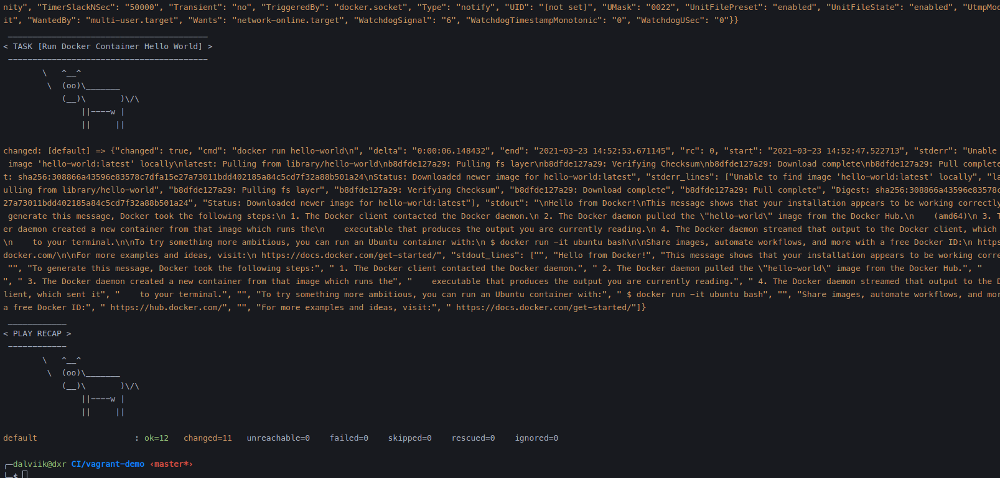

## Vagrant
Vagrant is a tool for building and managing virtual machine environments in a single workflow. With an easy-to-use workflow and focus on automation.

You can download vagrant in next url

https://www.vagrantup.com/downloads

Every Vagrant development environment requires a box. You can search for boxes at https://vagrantcloud.com/search.

To create a new vagrant file, you have to do

```sh
vagrant init
```
and this create a VagrantFile with base to config a new vm.

and to run you use the next command

```sh
vagrant up
```
In this project we have already config the virtual machine with an image with ubuntu


